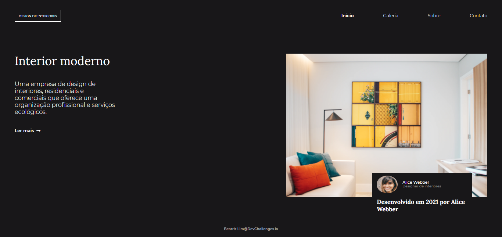

<!-- Please update value in the {}  -->

<h1 align="center">DevChallenges</h1>

   Solução para os desafios do  <a href="http://devchallenges.io" target="_blank">Devchallenges.io</a>.

<!-- TABLE OF CONTENTS -->

## Índice

- [Visão Geral](#visão-geral)
- [Soluções e Desafios](#soluções-e-desafios)
- [Contato](#contato)
<!-- - [Créditos](#acknowledgements) -->

<!-- OVERVIEW -->

## Visão Geral

## Soluções e Desafios

### <a href="./404pagechallenge"> 404 Error </a>

Esta página foi criada como uma submissão a um desafio [DevChallenges](https://devchallenges.io/challenges). O [desafio](https://devchallenges.io/challenges/wBunSb7FPrIepJZAg0sY) era construir uma página de erro para o usuário.

### Feito com
- [HTML](https://developer.mozilla.org/pt-BR/docs/Web/HTML)
- [CSS](https://developer.mozilla.org/pt-BR/docs/Web/CSS)

### <a href="./interiorconsultant"> Interior consultant </a>

Esta página foi criada como uma submissão a um desafio [DevChallenges](https://devchallenges.io/challenges). O [desafio](https://devchallenges.io/challenges/Jymh2b2FyebRTUljkNcb) era construir uma página de uma empresa de design de interiores.

### Feito com
- [HTML](https://developer.mozilla.org/pt-BR/docs/Web/HTML)
- [CSS](https://developer.mozilla.org/pt-BR/docs/Web/CSS)
- [JAVASCRIPT](https://developer.mozilla.org/pt-BR/docs/Web/JavaScript)

<!-- ## Créditos -->

<!-- This section should list any articles or add-ons/plugins that helps you to complete the project. This is optional but it will help you in the future. For exmpale -->

<!-- - [Steps to replicate a design with only HTML and CSS](https://devchallenges-blogs.web.app/how-to-replicate-design/)
- [Node.js](https://nodejs.org/)
- [Marked - a markdown parser](https://github.com/chjj/marked) -->

## Contato

- LinkedIn [Beatriz Lira](https://www.linkedin.com/beatrizliragonzaga)
- GitHub [@blirag](https://github.com/blirag)
- Twitter [@b_lirag](https://{twitter.com/b_lirag)
