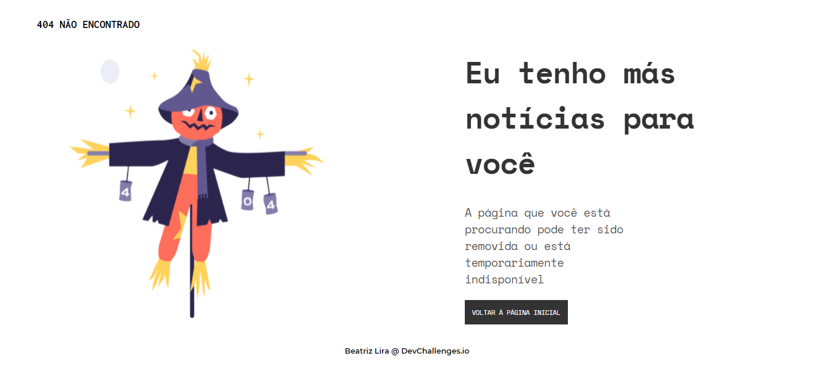

<!-- Please update value in the {}  -->

<h1 align="center">DevChallenges</h1>

   Solução para o desafio do  <a href="http://devchallenges.io" target="_blank">Devchallenges.io</a>.

  <h3>
    <a href="./404pagechallenge">
      Solução
    </a>
     | 
    <a href="https://devchallenges.io/challenges/wBunSb7FPrIepJZAg0sY">
      Desafio
    </a>
  </h3>

<!-- TABLE OF CONTENTS -->

## Índice

- [Visão Geral](#visão-geral)
  - [Feito com](#feito-com)
- [Desafio - 404 Error](#desafio-404-error)
- [Contato](#contato)
<!-- - [Créditos](#acknowledgements) -->

<!-- OVERVIEW -->

## Visão Geral

### Feito com

<!-- This section should list any major frameworks that you built your project using. Here are a few examples.-->

- [HTML](https://developer.mozilla.org/pt-BR/docs/Web/HTML)
- [CSS](https://developer.mozilla.org/pt-BR/docs/Web/CSS)
<!-- - [Tailwind](https://tailwindcss.com/) -->

## Desafio 404 Error

<!-- List the features of your application or follow the template. Don't share the figma file here :) -->

Esta página foi criada como uma submissão a um desafio [DevChallenges](https://devchallenges.io/challenges). O [desafio](https://devchallenges.io/challenges/wBunSb7FPrIepJZAg0sY) era construir uma página de erro para o usuário.

<!-- ## Créditos -->

<!-- This section should list any articles or add-ons/plugins that helps you to complete the project. This is optional but it will help you in the future. For exmpale -->

<!-- - [Steps to replicate a design with only HTML and CSS](https://devchallenges-blogs.web.app/how-to-replicate-design/)
- [Node.js](https://nodejs.org/)
- [Marked - a markdown parser](https://github.com/chjj/marked) -->

## Contato

- LinkedIn [Beatriz Lira](https://www.linkedin.com/beatrizliragonzaga)
- GitHub [@blirag](https://github.com/blirag)
- Twitter [@b_lirag](https://{twitter.com/b_lirag)
